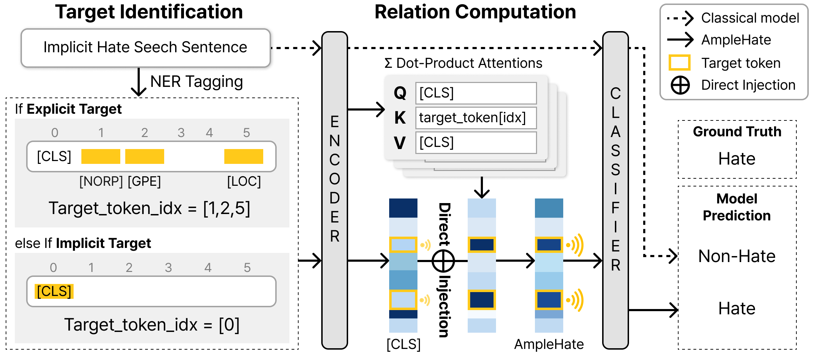

# AmpleHate: Amplifying the Attention for Versatile Implicit Hate Detection

📖 [Paper](https://arxiv.org/abs/2505.19528)

<span style="color: red">❗️***Warning**: this document contains content that may be offensive or upsetting.*</span>

> **AmpleHate** amplifies target-context relations for implicit hate speech detection, achieving 92.14% better performance than constrastive learning baselines.
 

## About AmpleHate
<p align="center">
  
</p>

**AmpleHate** amplifies target-context relationships for implicit hate speech detection.
Unlike explicit hate, implicit hate is subtle and depends heavily on context rather than offensive language. 
While existing models use contrastive learning, humans typically identify hate by first recognizing targets 
and then evaluating their context. Inspired by this process, AmpleHate uses a pre-trained Named Entity Recognition 
model to detect explicit targets and [CLS] tokens for implicit cues. It then applies attention-based mechanisms 
to model relationships between targets and context, directly integrating these signals into the sentence 
representation. This approach significantly boosts detection accuracy and achieves state-of-the-art results.

## Detection Framework
<p align="center">
  
</p>

**AmpleHate** mimics how humans detect implicit hate speech--by first identifying targets
and then interpreting context. It improves model focus on key signals through three main steps:

1. **Target Identification**
    - Uses a pre-trained NER model to extract **explicit targets** (e.g., groups, places, events)
    - Utilizes the Transformer's **[CLS] token** to represent **impilcit target** (overall conetxt of the sentence)
2. **Relation Computation**
    - Computes **attention-based interactions** between targets and context
    - These interactions from a **relation verctor** that captures how target mentions influence the sentence's hateful tone
3. **Direct Injection**
    - Injects the relation vector **directly into the sentence embedding ([CLS])**
    - This amplifies relevant target-context signals while reducing noise, making predictions more precise and human-aligned.


## Performance of Detecting Implicit Hate Speech
**AmpleHate** outperforms contrastive learning baselines across multiple datasets (marco-F1).

| Methods | IHC | SBIC | DYNA | Hateval | Toxigen | White | Ethos | Average |
|-------|-----|------|------|----------|--------|-------|-------|---------|
| BERT | 77.70 | 83.80 | 78.80 | 81.11 | 90.06 | 44.78 | 70.67 | 75.27 |
| SharedCon | 78.50 | **84.30** | 80.42 | 79.10 | 91.21 | 46.15 | 69.05 | 75.50 |
| LAHN | 78.40 | 83.98 | 79.64 | 80.42 | 90.42 | 47.85 | 75.26 | 76.56 |
| AmpleHate | **81.94** | 84.03 | **81.51** | **82.07** | **93.21** | **75.17** | **77.06** | **82.14** |

- **Consistently outperforms** existing baseline in macro-F1 score
- Achievew the **highest average marco-F1 scroe of 82.14**, surpassing the best baselin (LAHN) by ~5.6%p
- Especially strong on datasets with **subtle and context-dependent hate** (e.g., White: +27%p over BERT)

These result confirm that amplifying **target-context relationship** is highly effective for detecting implicit haet speech.

## 🔍 Qualitative Analysis
This table shows how **AmpleHate** idenfities key implicit hate indicators at the token level mirroring human attention patterns.

| Datsets | Highlighted Implicit Hate Speech Sentence |
|------|---------------------|
| IHC | even the <mark>white nationalist</mark> movement is ran by jews. |
| SBIC | Yo <mark>h**</mark> is like a tick so she <mark>hunting</mark> for a <mark>blood</mark> |
| DYNA | tell <mark>chi***</mark> to stop <mark>dressing</mark> like street walkers |
| Hateval | Arrest <mark>them</mark> and <mark>DEPORT</mark> THEM ALL!!!! #<mark>BuildThatWall</mark> |
| Toxigen | all <mark>black</mark> people are suspected of trying to pull something |
| White | The <mark>German men</mark> soud so sexy. |
| Ethos | Too bad <mark>women</mark> don't know how to ill <mark>themselves</mark> |

- For each dataset, AmpleHate assigns **higher attention signals** to contextially important tokens
- These tokens often **don't include explicit slurs**, but are essential to understanding the underlying bias or streotype.
- Compared to BERT, AmpleHate places more **precise focus** on hate-relevant cues, even when no explicit target is tagged.

This demonstrates that AmpleHate's **target-aware attention mechanism** effectively captures subtle signals in implicit hate speech-making the model both **inerpretable and accurate**.

## ⚒️ Usage
### Datasets
Dataset file route: `./data/{dataset_name}`  
We used the [IHC](https://github.com/SALT-NLP/implicit-hate), [SBIC](https://maartensap.com/social-bias-frames/), 
[DYNA](https://github.com/bvidgen/Dynamically-Generated-Hate-Speech-Dataset), [Hateval](https://aclanthology.org/S19-2081/), 
[Toxigen](https://github.com/microsoft/ToxiGen), [White](https://github.com/Vicomtech/hate-speech-dataset) 
and [Ethos](https://github.com/intelligence-csd-auth-gr/Ethos-Hate-Speech-Dataset) datasets.
### Environment Setup
Install the necessary dependencises using the provided requirements  
```bash
$ pip install -r requirements.txt
```

### Train
Modify the `config/train_config.py` file.   
```bash
$ python train.py
```

### Evaluation
Modify the `config/test_config.py` file.   
```bash
$ python test.py
```
